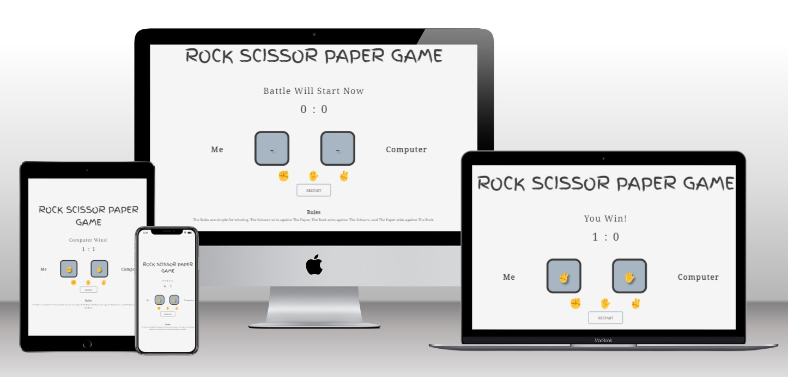
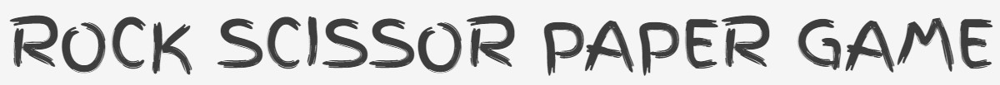
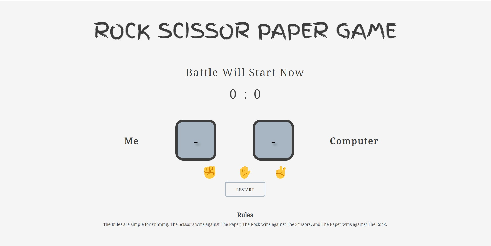
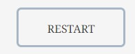
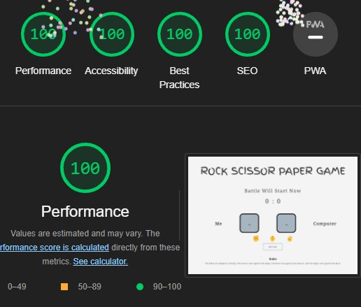
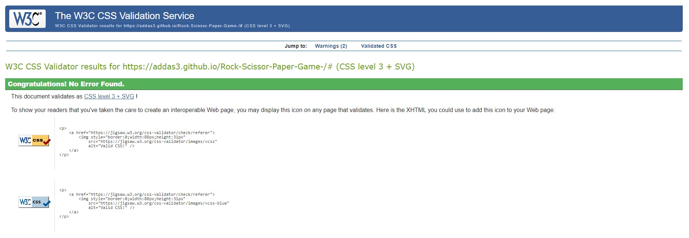
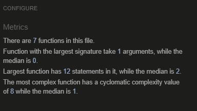

# Rock Scissor Paper Game

Rock Scissor Paper Game is a well known game that all people knows about it. The website challange people to dsicover the game and challange them also to beat the computer. In addition, the website aim to make sure users enjoy there time and to let them use their brain. View the live site [here](https://addas3.github.io/Rock-Scissor-Paper-Game-/#)



## Features 

### Title Text
* Head Text
    * The concept is to give the user a full understanging of whats the website is about. 



### Landing Page
* Landing page image
    * This section shows most of the function that the user will have. 
    * This section give the user direct idea of wha the website about.    

 
* Start and Result Text
    * Here there is information on the result the user and the computer will get for each round.
    * This section will help the user to get better knowledge about the result. 

  

* Section Aginst
    * Section aginst is there to help the user to see the option choisen and what the computer choose at the same time.
    * Section aginst at the start will not show any emoji tell the player select an option.
    * Section aginst will help users to keep track on choices.


* Section Options
    * Here user can see thre different emoji where he/she can slect from.
    * Once the user select the prefered emoji it will reflect directly to the section aginst section also.
    * The user will get the result if he/she wins, loses aginst the computer or if its a tie.


* Restart Button
    * This button will let the user start the game from the begining.
    

 

* Footer
    * This section has the rules of the game
    


### 404 Page
    * This page is a custom 404 page which is an error page that a website displays when a user tries to access a page that doesn't exist.
    * There is Navigation link which will take the user to the right page of the game.


### Existing Features

* Responsive design
* Functions that reflect the live game


### Features Left to Implement

* Building feedback section for the users.


## Technologies

* HTML
    * The structure of the Website was developed using HTML as the main language.
* CSS
    * The Website was styled using custom CSS in an external file.
* JavaScript
    * The Website was animated using custom JS in an external file.    
* GitHub
    * Source code is hosted on GitHub and delpoyed using Git Pages.
* Git 
    * Used to commit and push code during the development opf the Website
* Font Awesome
    * Icons obtained from https://fontawesome.com/ were used as the Social media links in the footer section. 
* Tinyjpg
    * https://tinyjpg.com/ was used to reduce the size of the images used throughout the website

### Responsiveness

All pages were tested to ensure responsiveness on screen sizes from 320px and upwards as defined in [WCAG 2.1 Reflow criteria for responsive design](https://www.w3.org/WAI/WCAG21/Understanding/reflow.html) on Chrome, Edge, Firefox and Opera browsers.

Steps to test:

1. Open browser and navigate to [Rock Scissor Paper Game](https://addas3.github.io/Rock-Scissor-Paper-Game-/#)
2. Open the developer tools (right click and inspect)
3. Set to responsive and decrease width to 320px
4. Set the zoom to 50%
5. Click and drag the responsive window to maximum width


Website is responsive on all screen sizes and no images are pixelated or stretched.
No horizontal scroll is present.
No elements overlap.

### Accessibility

[Wave Accessibility](https://wave.webaim.org/) tool was used throughout development and for final testing of the deployed website to check for any aid accessibility testing.

Testing was focused to ensure the following criteria were met:

- All forms have associated labels or aria-labels so that this is read out on a screen reader to users who tab to form inputs
- Color contrasts meet a minimum ratio as specified in [WCAG 2.1 Contrast Guidelines](https://www.w3.org/WAI/WCAG21/Understanding/contrast-minimum.html)
- Heading levels are not missed or skipped to ensure the importance of content is relayed correctly to the end user
- All content is contained within landmarks to ensure ease of use for assistive technology, allowing the user to navigate by page regions
- All not textual content had alternative text or titles so descriptions are read out to screen readers
- HTML page lang attribute has been set
- Aria properties have been implemented correctly
- WCAG 2.1 Coding best practices being followed

Manual tests were also performed to ensure the website was accessible as possible and an accessibility issue was identified.

### Lighthouse Testing

* For Desktop



* For Mobile


### Functional Testing


**Game Testing**

* Tried to click on the rock, and it worked as expected with no return erros. 

    -Incase the user win it reflect the results and it gives text that you win!.

    


    -Incase the computer wins it reflect the results and it gives text that computer wins! 

    


    -Incase it was tie it reflect the results and it gives text that its a tie.

    


* Tried to click on the paper, and it worked as expected with no return erros. 

    -Incase the user win it reflect the results and it gives text that you win!.

    


    -Incase the computer wins it reflect the results and it gives text that computer wins! 

    


    -Incase it was tie it reflect the results and it gives text that its a tie.

    

* Tried to click on the scissors, and it worked as expected with no return erros. 

    -Incase the user win it reflect the results and it gives text that you win!.

    


    -Incase the computer wins it reflect the results and it gives text that computer wins! 

    


    -Incase it was tie it reflect the results and it gives text that its a tie.

    


**Restart button**

* Testing was performed on the restart button and it worked as expected to start the game from over and reset all the elements.

 

### Validator Testing 

- HTML
  - No errors were returned when passing through the official [W3C validator](https://validator.w3.org) 


- CSS
  - No errors were found when passing through the official [(Jigsaw) validator](https://jigsaw.w3.org)



- JS
  - No errors were found when passing through the official [(Jshint) validator](https://jshint.com/)
  - The following metrics were returned:
  



### Bugs

  - The background color was not full on all the page as I wrote the code in the body instead of * which target all the page.
  - Button id rock was dublicated so I fixed it with the coreect input.
  - While testing notice it that the scissors was not finctionally working, it was due to typo I missed the s in the car choices, but 
    now its fixed.
  - While testing notice it that the player only wins if the player select paper but for scissors and rock was not the case. It was  
    typo mistake for the scissors in the JavaScript in game function fixed it and all the options are working now.
  - Color scheme was not giving good contrast. Fixed it with light colors
  - Favicon was not working when the webiste was deployed, fixed it by adding link in index.html.
  - When I reset the game it was not resetting the result, emoji status and the text for start, so I fixed that by updating the rest 
    function in Java Script.
  - When user tries to navigate to other page it was naviagting to nothing, so I created 404.html to fix this issue.


  

## Deployment

### Version Control

The site was created using the Visual Studio code editor and pushed to github to the remote repository ‘tacos-travels’.

The following git commands were used throughout development to push code to the remote repo:

```git add <file>``` - This command was used to add the file(s) to the staging area before they are committed.

```git commit -m “commit message”``` - This command was used to commit changes to the local repository queue ready for the final step.

```git push``` - This command was used to push all committed code to the remote repository on github.

### Deployment to Github Pages

- The site was deployed to GitHub pages. The steps to deploy are as follows: 
  - In the GitHub repository, navigate to the Settings tab 
  - From the menu on left select 'Pages'
  - From the source section drop-down menu, select the Branch: main
  - Click 'Save'
  - A live link will be displayed in a green banner when published successfully. 

The live link can be found here - https://addas3.github.io/Rock-Scissor-Paper-Game-/#

### Clone the Repository Code Locally

Navigate to the GitHub Repository you want to clone to use locally:

- Click on the code drop down button
- Click on HTTPS
- Copy the repository link to the clipboard
- Open your IDE of choice (git must be installed for the next steps)
- Type git clone copied-git-url into the IDE terminal

The project will now of been cloned on your local machine for use.

## Credits 

### Content

* [Making Space](https://mailtrap.io/blog/nbsp/)
    * I got to know how to make space by using (&nbsp) in HTML.

* [favicon](https://www.w3schools.com/html/html_favicon.asp)
    * I got to know how to do and fix favicon.

* [404 Page](https://docs.github.com/en/pages/getting-started-with-github-pages/creating-a-custom-404-page-for-your-github-pages-site/)
    * I got to know how to do 404 page.


* Inspired some of the codes from Love Project Math.

### Media

* [All Emoji](https://emojiclipboard.com/category/hands/)
    * All emoji were taken from above website. 
